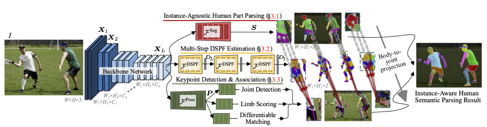

> [**Differentiable Multi-Granularity Human Representation Learning for Instance-Aware Human Semantic Parsing**](https://arxiv.org/abs/2103.04570),            
> [Tianfei Zhou](https://www.tfzhou.com/), [Wenguan Wang](https://sites.google.com/view/wenguanwang/), Si Liu, Yi Yang and [Luc Van Gool](https://scholar.google.com/citations?user=TwMib_QAAAAJ&hl=en)  
> *CVPR 2021 (Oral)*  

## Abstract

To address the challenging task of instance-aware hu- man part parsing, a new bottom-up regime is proposed to learn category-level human semantic segmentation as well as multi-person pose estimation in a joint and end-to-end manner. It is a compact, efficient and powerful framework that exploits structural information over different human granularities and eases the difficulty of person partition- ing. Specifically, a dense-to-sparse projection field, which allows explicitly associating dense human semantics with sparse keypoints, is learnt and progressively improved over the network feature pyramid for robustness. Then, the dif- ficult pixel grouping problem is cast as an easier, multi- person joint assembling task. By formulating joint associa- tion as maximum-weight bipartite matching, a differentiable solution is developed to exploit projected gradient descent and Dykstra’s cyclic projection algorithm. This makes our method end-to-end trainable and allows back-propagating the grouping error to directly supervise multi-granularity human representation learning. This is distinguished from current bottom-up human parsers or pose estimators which require sophisticated post-processing or heuristic greedy algorithms. Experiments on three instance-aware human parsing datasets show that our model outperforms other bottom-up alternatives with much more efficient inference.

## Code

_The code will be available before June 15. Please stay tuned._
